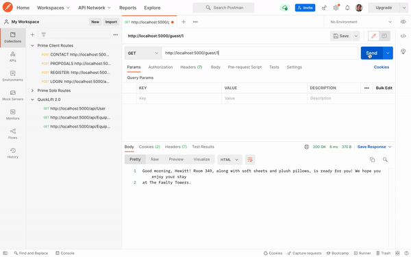

# Overview

Connecting with guests in a personal way can leave a lasting impact on their impressions with a brand. Create a simulation where a guest receives a custom message prior to their check in.

Example: 
> "Good morning Ethan, and welcome to Hotel California! Room 304 is now ready you. Enjoy your stay, and let us know if you need anything."
- - - -
# Wireframe 

- - - -
# Instructions
This application was created and tested using JavaScript, Node, Postico, and Postman. Follow the instructions below for running the program:

- Install Node dependencies (NPM install in the terminal)
- Create a table called 'uspik_interview' in the database
- Copy the SQL queries found in the database.sql file and paste it into the SQL query view within Postico
- Start your server (NPM start)

Once the server is started, head over to Postman (or its equivalent) and paste the URL below to receive a personalized message for any given guest:
> http://localhost:5000/guest/:id

The parameter ':id' represents a guest's unique 'id'. There are six ID's to choose from in this simulation (1-6). The wireframe above is a good reference for what you should be receiving as a result from the server.
- - - -
# Design and Approach
In order to deliver a personalized message that factored in all information related to the guest, I knew I had to take a step back and map out how each entity related to one another. 

I started approaching this challenge by sketching out each entity (guests, reservations, companies, and messageTemplates) and working through their relationships to one another. This helped me realize that everything would revolve around the "guest" entity.

Tables were created to reflect this realization, which allowed me to select everything from the database that was connected to any given guest.

My process for delivering a personable message to a guest is listed below:
1. Select the guests information, their reservation, and the company associated with the given reservation.

2. Select all message templates and randomly choose one of them for the guest.

3. Replace all variables within the message template with variables associated with the guest. The placeholders were strategically given names with a '#' (ex: #firstName) in front of them to easily distinguish them from the rest of the words in the message.

4. Convert the timestamp to a readable string for determining what kind of greeting they should receive (ex: Good morning).

5. Send the personalized message back to the user.
- - - -
# Technology used
After reading through the prompt, I knew I could accomplish this challenge using JavaScript. I chose JavaScript because I'm comfortable with the language and knew I could use specific methods within the language for delivering a personalized message for a given guest. Postico (postgreSQL) was ideal for me for quickly and easily organizing a database that connected all entities to the user.
- - - -
# Verifying correctness
I used Postman and many console logs to determine the program was operating as it should. Console logging each step in the process helped me remain efficient as I worked towards the end goal, while Postman was used to test one guest alongside others to ensure the content was dynamically changing from one to the next.
- - - -
# Next steps
I wanted to make sure I created a program that worked within the window of time I was given, but I'm absolutely positive I could make this into an interactive user interface with just a little more time. I envision a front-end where users can select which guest they would like to receive a message for, as well as a view where new guests can be added for when reservations are made. 

I would definitely implement strong input validation to ensure the program would be receiving everything it would need to eventually deliver a personalized message to any guest. 